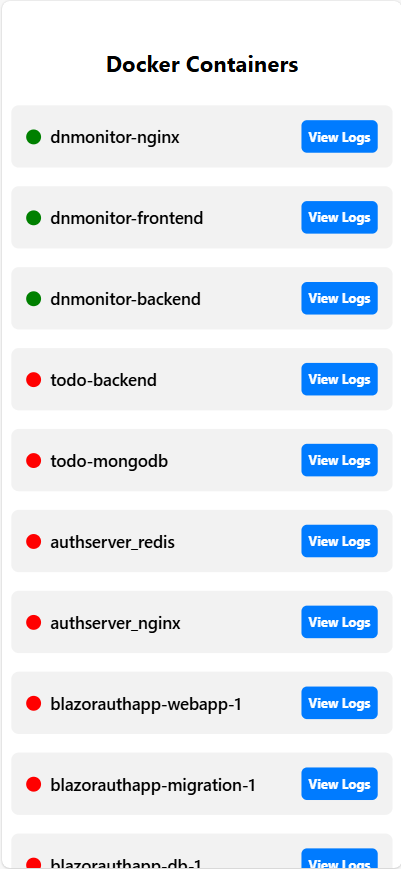
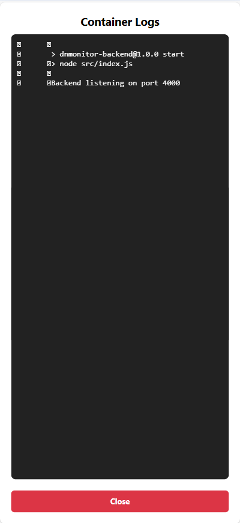

# DNMonitor - Docker Container Monitoring Application


A full-stack application for monitoring Docker containers with a React Native (Expo) frontend and Node.js backend, all running in Docker with hot-reload support.


## 🚀 FeaturesA full-stack application for monitoring Docker containers with a React Native (Expo) frontend and Node.js backend, all running in Docker with hot-reload support.## Architecture


- **Real-time Container Monitoring**: View all Docker containers (running and stopped)- **Server**: Backend + Nginx (runs on your server via Docker)

- **Status Indicators**: Visual status indicators (green for running, red for stopped)

- **Container Logs**: View the last 10 lines of logs for any container## 🚀 Features- **Mobile**: React Native app (runs on your phone via Expo Go)

- **Pull to Refresh**: Manually refresh the container list

- **Hot Reload Development**: Code changes automatically reflect in the browser

- **Dockerized Setup**: Everything runs in Docker containers

- **Multi-Platform**: Run on web browser or mobile (iOS/Android via Expo Go)- **Real-time Container Monitoring**: View all Docker containers (running and stopped)## Server Setup (Deploy to your server)


## 📸 Screenshots- **Status Indicators**: Visual status indicators (green for running, red for stopped)


### Container List View- **Container Logs**: View the last 10 lines of logs for any container1. **Copy to your server**:

The main interface showing all Docker containers with their status indicators.

- **Pull to Refresh**: Manually refresh the container list   ```bash



- **Hot Reload Development**: Code changes automatically reflect in the browser   # Copy backend and nginx folders to your server

### Container Details & Logs

Click on "View Logs" to see the last 10 lines of logs for any container.- **Dockerized Setup**: Everything runs in Docker containers   scp -r backend nginx docker-compose.yml user@your-server:/path/to/dnmonitor/


- **Multi-Platform**: Run on web browser or mobile (iOS/Android via Expo Go)   ```


## 📋 Prerequisites


- Docker Desktop (Windows/Mac/Linux)## 📋 Prerequisites2. **Deploy on server**:

- Docker Compose

- Ports available: 80, 4000, 8081, 8082, 19000-19002   ```bash


## 🏗️ Architecture- Docker Desktop (Windows/Mac/Linux)   cd /path/to/dnmonitor


```- Docker Compose   docker compose up --build -d

┌─────────────────────────────────────────┐

│  Frontend (Expo Web) - Port 8081       │- Ports available: 80, 4000, 8081, 8082, 19000-19002   ```

│  - React Native Web                    │

│  - Lists all Docker containers         │

│  - Shows status & logs                 │

└──────────────┬──────────────────────────┘## 🏗️ Architecture3. **Verify**:

               │ HTTP API calls

               ↓   ```bash

┌──────────────────────────────────────────┐

│  Nginx - Port 80                         │```   curl http://localhost/api/containers

│  - Reverse proxy                         │

│  - Routes /api → backend:4000           │┌─────────────────────────────────────────┐   ```

└──────────────┬───────────────────────────┘

               ││  Frontend (Expo Web) - Port 8081       │

               ↓

┌──────────────────────────────────────────┐│  - React Native Web                    │4. **Configure firewall** (if needed):

│  Backend - Port 4000                     │

│  - Node.js + Express                    ││  - Lists all Docker containers         │   ```bash

│  - Dockerode (Docker API client)        │

│  - Connected to Docker socket           ││  - Shows status & logs                 │   # Allow port 80

└──────────────┬───────────────────────────┘

               │└──────────────┬──────────────────────────┘   sudo ufw allow 80/tcp

               ↓

    Docker Socket (/var/run/docker.sock)               │ HTTP API calls   ```

```

               ↓

## 📁 Project Structure

┌──────────────────────────────────────────┐## Mobile Setup (Run on your phone)

```

DNMonitor/│  Nginx - Port 80                         │

├── backend/

│   ├── src/│  - Reverse proxy                         │1. **Install Expo Go** on your phone:

│   │   └── index.js          # Express server with Docker API

│   ├── Dockerfile│  - Routes /api → backend:4000           │   - Android: [Google Play Store](https://play.google.com/store/apps/details?id=host.exp.exponent)

│   └── package.json

├── frontend/└──────────────┬───────────────────────────┘   - iOS: [App Store](https://apps.apple.com/app/expo-go/id982107779)

│   ├── App.js                # React Native main app

│   ├── app.json              # Expo configuration               │

│   ├── Dockerfile

│   └── package.json               ↓2. **Update API URL** in `frontend/App.js`:

├── nginx/

│   ├── nginx.conf            # Nginx reverse proxy config┌──────────────────────────────────────────┐   ```javascript

│   └── Dockerfile

├── images/│  Backend - Port 4000                     │   const API_URL = 'http://YOUR_SERVER_IP/api';

│   ├── image.png             # Container list screenshot

│   └── details.png           # Container logs screenshot│  - Node.js + Express                    │   ```

├── docker-compose.yml        # Orchestrates all services

└── README.md│  - Dockerode (Docker API client)        │   Replace `YOUR_SERVER_IP` with your actual server IP address.

```

│  - Connected to Docker socket           │

## 🚦 Quick Start

└──────────────┬───────────────────────────┘3. **Install dependencies**:

### 1. Clone or navigate to the project directory

               │   ```bash

```bash

cd DNMonitor               ↓   cd frontend

```

    Docker Socket (/var/run/docker.sock)   npm install

### 2. Start all services

```   ```

```bash

docker compose up -d --build

```

## 📁 Project Structure4. **Start Expo**:

This will:

- Build all Docker images (backend, frontend, nginx)   ```bash

- Start all containers in detached mode

- Install all dependencies```   npx expo start

- Set up hot-reload for development

DNMonitor/   ```

### 3. Access the application

├── backend/

- **Web Application**: http://localhost:8081

- **API Endpoint**: http://localhost/api/containers│   ├── src/5. **Scan QR code** with Expo Go app on your phone.

- **Health Check**: http://localhost/health

│   │   └── index.js          # Express server with Docker API

### 4. View logs (optional)

│   ├── Dockerfile## API Endpoints

```bash

# View all logs│   └── package.json

docker compose logs -f

├── frontend/- `GET http://YOUR_SERVER_IP/api/containers` - List all containers

# View specific service logs

docker compose logs -f frontend│   ├── App.js                # React Native main app- `GET http://YOUR_SERVER_IP/api/containers/:id/logs` - Get last 10 log lines

docker compose logs -f backend

docker compose logs -f nginx│   ├── app.json              # Expo configuration- `GET http://YOUR_SERVER_IP/health` - Nginx health check

```

│   ├── Dockerfile

## 🛠️ Development

│   └── package.json## Notes

### Hot Reload

├── nginx/

The frontend is configured with volume mounting for hot-reload. Any changes to `frontend/App.js` will automatically refresh in the browser.

│   ├── nginx.conf            # Nginx reverse proxy config- Make sure your server IP is accessible from your mobile device

```bash

# Make changes to frontend/App.js and watch them reload automatically!│   └── Dockerfile- If using HTTPS, update the API_URL to use `https://`

```

├── docker-compose.yml        # Orchestrates all services- For production, consider using environment variables or a config file for the API URL

### Stop the application

└── README.md

```bash```

docker compose down

```## 🚦 Quick Start


### Rebuild after changes### 1. Clone or navigate to the project directory


```bash```bash

docker compose up -d --buildcd DNMonitor

``````


## 📱 Mobile Testing (Expo Go)### 2. Start all services


To test on your mobile device using Expo Go:```bash

docker compose up -d --build

1. **Install Expo Go** app on your phone:```

   - Android: [Google Play Store](https://play.google.com/store/apps/details?id=host.exp.exponent)

   - iOS: [App Store](https://apps.apple.com/app/expo-go/id982107779)This will:

- Build all Docker images (backend, frontend, nginx)

2. **Make sure containers are running**:- Start all containers in detached mode

   ```bash- Install all dependencies

   docker compose up -d- Set up hot-reload for development

   ```

### 3. Access the application

3. **Check the terminal** for the QR code (or run):

   ```bash- **Web Application**: http://localhost:8081

   docker logs dnmonitor-frontend- **API Endpoint**: http://localhost/api/containers

   ```- **Health Check**: http://localhost/health


4. **Scan the QR code** with Expo Go (Android) or Camera app (iOS)### 4. View logs (optional)


## 🔌 API Endpoints```bash

# View all logs

### Backend API (via Nginx at http://localhost/api)docker compose logs -f


#### Get all containers# View specific service logs

```docker compose logs -f frontend

GET /api/containersdocker compose logs -f backend

```docker compose logs -f nginx

```

**Response:**

```json## 🛠️ Development

[

  {### Hot Reload

    "id": "abc123...",

    "name": "dnmonitor-backend",The frontend is configured with volume mounting for hot-reload. Any changes to `frontend/App.js` will automatically refresh in the browser.

    "image": "dnmonitor-backend:latest",

    "state": "running",```bash

    "ports": [# Make changes to frontend/App.js and watch them reload automatically!

      {```

        "private": 4000,

        "public": null,### Stop the application

        "type": "tcp"

      }```bash

    ]docker compose down

  }```

]

```### Rebuild after changes


#### Get container logs```bash

```docker compose up -d --build

GET /api/containers/:id/logs```

```

## 📱 Mobile Testing (Expo Go)

**Response:** Plain text with last 10 log lines

To test on your mobile device using Expo Go:

## 📦 Technologies Used

1. **Install Expo Go** app on your phone:

### Frontend   - Android: [Google Play Store](https://play.google.com/store/apps/details?id=host.exp.exponent)

- React Native   - iOS: [App Store](https://apps.apple.com/app/expo-go/id982107779)

- Expo (v50.0.0)

- React Native Web2. **Make sure containers are running**:

- React DOM (for web support)   ```bash

- Axios   docker compose up -d

   ```

### Backend

- Node.js3. **Check the terminal** for the QR code (or run):

- Express   ```bash

- Dockerode (Docker API client)   docker logs dnmonitor-frontend

- CORS   ```


### Infrastructure4. **Scan the QR code** with Expo Go (Android) or Camera app (iOS)

- Docker & Docker Compose

- Nginx (Reverse Proxy)## 🔌 API Endpoints


## 🔧 Configuration### Backend API (via Nginx at http://localhost/api)


### Environment Variables#### Get all containers

```

#### Frontend (`docker-compose.yml`)GET /api/containers

- `EXPO_DEVTOOLS_LISTEN_ADDRESS=0.0.0.0` - Allow external connections```

- `REACT_NATIVE_PACKAGER_HOSTNAME` - Set to your local IP for mobile testing

**Response:**

#### Backend```json

- `PORT=4000` - Backend server port (default: 4000)[

  {

### Ports    "id": "abc123...",

    "name": "dnmonitor-backend",

| Service  | Internal Port | External Port | Description              |    "image": "dnmonitor-backend:latest",

|----------|---------------|---------------|--------------------------|    "state": "running",

| Nginx    | 80            | 80            | Reverse proxy            |    "ports": [

| Backend  | 4000          | -             | API server (internal)    |      {

| Frontend | 8081          | 8081          | Metro bundler (web)      |        "private": 4000,

| Frontend | 8082          | 8082          | Web server               |        "public": null,

| Frontend | 19000-19002   | 19000-19002   | Expo DevTools            |        "type": "tcp"

      }

## 🐛 Troubleshooting    ]

  }

### Containers won't start]

```bash```

# Clean up and restart

docker compose down#### Get container logs

docker compose up -d --build```

```GET /api/containers/:id/logs

```

### Port already in use

```bash**Response:** Plain text with last 10 log lines

# Find what's using the port

netstat -ano | findstr :8081  # Windows## 📦 Technologies Used

lsof -i :8081                  # Mac/Linux

### Frontend

# Stop the conflicting process or change ports in docker-compose.yml- React Native

```- Expo (v50.0.0)

- React Native Web

### Frontend not loading- React DOM (for web support)

```bash- Axios

# Check frontend logs

docker logs -f dnmonitor-frontend### Backend

- Node.js

# Rebuild frontend- Express

docker compose up -d --build frontend- Dockerode (Docker API client)

```- CORS


### Cannot connect to Docker socket### Infrastructure

- Ensure Docker Desktop is running- Docker & Docker Compose

- Check Docker socket is mounted: `/var/run/docker.sock:/var/run/docker.sock`- Nginx (Reverse Proxy)


### Nginx keeps restarting## 🔧 Configuration

```bash

# Check nginx config syntax### Environment Variables

docker exec dnmonitor-nginx nginx -t

#### Frontend (`docker-compose.yml`)

# View nginx logs- `EXPO_DEVTOOLS_LISTEN_ADDRESS=0.0.0.0` - Allow external connections

docker logs dnmonitor-nginx- `REACT_NATIVE_PACKAGER_HOSTNAME` - Set to your local IP for mobile testing

```

#### Backend

### API calls failing from frontend- `PORT=4000` - Backend server port (default: 4000)

- Check API_URL in `frontend/App.js` is set to `http://localhost/api`

- Verify backend is running: `docker ps | grep dnmonitor-backend`### Ports

- Test API directly: `curl http://localhost/api/containers`

| Service  | Internal Port | External Port | Description              |

## 🔄 Development Workflow|----------|---------------|---------------|--------------------------|

| Nginx    | 80            | 80            | Reverse proxy            |

### Making Changes| Backend  | 4000          | -             | API server (internal)    |

| Frontend | 8081          | 8081          | Metro bundler (web)      |

1. **Frontend changes**: Edit `frontend/App.js` → changes auto-reload in browser| Frontend | 8082          | 8082          | Web server               |

2. **Backend changes**: Edit `backend/src/index.js` → restart backend:| Frontend | 19000-19002   | 19000-19002   | Expo DevTools            |

   ```bash

   docker compose restart backend## 🐛 Troubleshooting

   ```

3. **Nginx changes**: Edit `nginx/nginx.conf` → rebuild nginx:### Containers won't start

   ```bash```bash

   docker compose up -d --build nginx# Clean up and restart

   ```docker compose down

docker compose up -d --build

### Adding Dependencies```


#### Frontend### Port already in use

1. Add package to `frontend/package.json````bash

2. Rebuild:# Find what's using the port

   ```bashnetstat -ano | findstr :8081  # Windows

   docker compose up -d --build frontendlsof -i :8081                  # Mac/Linux

   ```

# Stop the conflicting process or change ports in docker-compose.yml

#### Backend```

1. Add package to `backend/package.json`

2. Rebuild:### Frontend not loading

   ```bash```bash

   docker compose up -d --build backend# Check frontend logs

   ```docker logs -f dnmonitor-frontend


## 🌐 Remote/Server Deployment# Rebuild frontend

docker compose up -d --build frontend

### Deploy to Remote Server```


1. **Copy project to server**:### Cannot connect to Docker socket

   ```bash- Ensure Docker Desktop is running

   scp -r . user@your-server:/path/to/dnmonitor/- Check Docker socket is mounted: `/var/run/docker.sock:/var/run/docker.sock`

   ```

### Nginx keeps restarting

2. **SSH into server and start**:```bash

   ```bash# Check nginx config syntax

   ssh user@your-serverdocker exec dnmonitor-nginx nginx -t

   cd /path/to/dnmonitor

   docker compose up -d --build# View nginx logs

   ```docker logs dnmonitor-nginx

```

3. **Update frontend API URL** in `frontend/App.js`:

   ```javascript### API calls failing from frontend

   const API_URL = process.env.EXPO_PUBLIC_API_URL || 'http://YOUR_SERVER_IP/api';- Check API_URL in `frontend/App.js` is set to `http://localhost/api`

   ```- Verify backend is running: `docker ps | grep dnmonitor-backend`

- Test API directly: `curl http://localhost/api/containers`

4. **Configure firewall**:

   ```bash## 🔄 Development Workflow

   sudo ufw allow 80/tcp

   ```### Making Changes


## 📝 Notes1. **Frontend changes**: Edit `frontend/App.js` → changes auto-reload in browser

2. **Backend changes**: Edit `backend/src/index.js` → restart backend:

- The application monitors the Docker instance it's running in (Docker-in-Docker)   ```bash

- Container logs show only the last 10 lines (configurable in `backend/src/index.js`)   docker compose restart backend

- Nginx serves as a reverse proxy to handle CORS and routing   ```

- Frontend runs in web mode by default (can also run on mobile via Expo Go)3. **Nginx changes**: Edit `nginx/nginx.conf` → rebuild nginx:

- Volume mounting enables hot-reload without rebuilding containers   ```bash

- Favicon warnings in logs are harmless and don't affect functionality   docker compose up -d --build nginx

   ```

## 🎯 Future Enhancements

### Adding Dependencies

- [ ] Real-time updates using WebSockets

- [ ] Container start/stop/restart functionality#### Frontend

- [ ] Resource usage metrics (CPU, Memory)1. Add package to `frontend/package.json`

- [ ] Container filtering and search2. Rebuild:

- [ ] Dark mode support   ```bash

- [ ] Export logs functionality   docker compose up -d --build frontend

- [ ] Multi-host Docker support   ```

- [ ] Authentication/Authorization

- [ ] Persist settings/preferences#### Backend

- [ ] Container stats visualization1. Add package to `backend/package.json`

2. Rebuild:

## 🤝 Contributing   ```bash

   docker compose up -d --build backend

Feel free to fork this project and submit pull requests for any improvements!   ```


## 📄 License## 🌐 Remote/Server Deployment


This project is open source and available for educational and personal use.### Deploy to Remote Server


---1. **Copy project to server**:

   ```bash

**Built with ❤️ using Docker, React Native, Expo, and Node.js**   scp -r . user@your-server:/path/to/dnmonitor/

   ```

2. **SSH into server and start**:
   ```bash
   ssh user@your-server
   cd /path/to/dnmonitor
   docker compose up -d --build
   ```

3. **Update frontend API URL** in `frontend/App.js`:
   ```javascript
   const API_URL = process.env.EXPO_PUBLIC_API_URL || 'http://YOUR_SERVER_IP/api';
   ```

4. **Configure firewall**:
   ```bash
   sudo ufw allow 80/tcp
   ```

## 📝 Notes

- The application monitors the Docker instance it's running in (Docker-in-Docker)
- Container logs show only the last 10 lines (configurable in `backend/src/index.js`)
- Nginx serves as a reverse proxy to handle CORS and routing
- Frontend runs in web mode by default (can also run on mobile via Expo Go)
- Volume mounting enables hot-reload without rebuilding containers
- Favicon warnings in logs are harmless and don't affect functionality

## 🎯 Future Enhancements

- [ ] Real-time updates using WebSockets
- [ ] Container start/stop/restart functionality
- [ ] Resource usage metrics (CPU, Memory)
- [ ] Container filtering and search
- [ ] Dark mode support
- [ ] Export logs functionality
- [ ] Multi-host Docker support
- [ ] Authentication/Authorization
- [ ] Persist settings/preferences
- [ ] Container stats visualization

## 🤝 Contributing

Feel free to fork this project and submit pull requests for any improvements!

## 📄 License

This project is open source and available for educational and personal use.

---

**Built with ❤️ using Docker, React Native, Expo, and Node.js**
