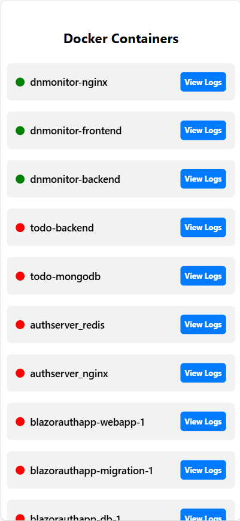
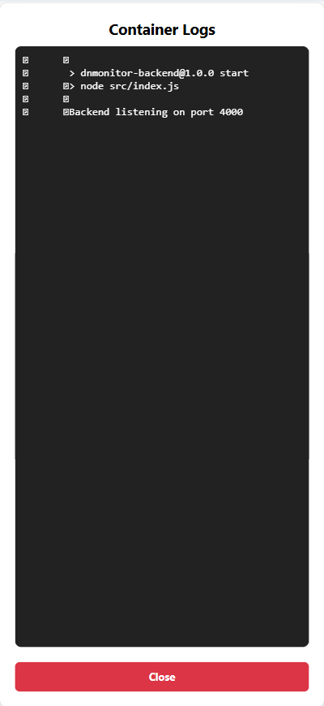

# DNMonitor - Real-Time Docker Network Monitoring System

A comprehensive full-stack Docker monitoring application with real-time WebSocket updates, featuring a modern Next.js web dashboard and Node.js backend. Monitor any Docker network with container stats, system metrics, and live logs.

## 🚀 Key Features

### Real-Time Monitoring (WebSocket-Powered)
- **Live Container Stats**: CPU, Memory, and Network usage updated every second via WebSocket
- **System Stats**: Host machine metrics (CPU, Memory, Disk) streamed in real-time
- **Container List**: Auto-updating container list every 5 seconds
- **Zero Polling**: All data pushed via WebSocket - no REST API polling

### Container Management
- **Status Indicators**: Visual indicators (green for running, red for stopped, yellow for restarting)
- **Container Controls**: Start, Stop, Restart, and Delete containers with confirmation dialogs
- **Live Logs**: Stream container logs with auto-refresh
- **Docker Compose Integration**: Control compose stacks (up, down, rebuild)

### Authentication & Security
- **JWT Authentication**: Secure token-based authentication
- **Role-Based Access**: Admin and viewer roles
- **Protected Routes**: All API endpoints secured with JWT middleware
- **WebSocket Authentication**: Socket.IO connections authenticated via JWT

### Modern UI/UX
- **Cyberpunk Theme**: Futuristic neon-styled interface
- **Responsive Design**: Works on desktop, tablet, and mobile
- **Real-Time Updates**: Live data without page refresh
- **Modal Dialogs**: View logs and confirm actions without navigation

## 📸 Screenshots

### Container List View
The main interface showing all Docker containers with their status indicators.



### Container Details & Logs
Click on "View Logs" to see the last 10 lines of logs for any container.



## 📋 Prerequisites

- Docker Desktop (Windows/Mac/Linux)
- Docker Compose
- Ports available: 80, 4000, 8081, 8082, 19000-19002

## 🏗️ System Architecture

### High-Level Overview

```
┌─────────────────────────────────────────────────────────────────┐
│                        Browser Client                           │
│  - Next.js Web Dashboard (Port 3002)                           │
│  - React Components with TanStack Query                        │
│  - Socket.IO Client for Real-Time Updates                     │
└────────────────┬────────────────────────────────────────────────┘
                 │
                 │ HTTP/HTTPS + WebSocket
                 ↓
┌─────────────────────────────────────────────────────────────────┐
│                      Nginx (Port 8080)                          │
│  - Reverse Proxy & Load Balancer                              │
│  - Routes /api/* → Backend API                                │
│  - Routes /socket.io/* → WebSocket Server                     │
│  - WebSocket Upgrade Support                                   │
└────────────────┬────────────────────────────────────────────────┘
                 │
                 ↓
┌─────────────────────────────────────────────────────────────────┐
│                  Backend Server (Port 4000)                     │
│  ┌──────────────────────────────────────────────────────────┐  │
│  │  Express.js REST API                                     │  │
│  │  - Container CRUD operations                             │  │
│  │  - System stats endpoints                                │  │
│  │  - Authentication (JWT)                                  │  │
│  │  - Docker Compose control                                │  │
│  └──────────────────────────────────────────────────────────┘  │
│  ┌──────────────────────────────────────────────────────────┐  │
│  │  Socket.IO WebSocket Server                              │  │
│  │  - Real-time container stats (1s interval)              │  │
│  │  - Real-time system stats    # Express + Socket.IO server
│   ├── Dockerfile                # Backend container config
│   └── package.json              # Dependencies: express, socket.io, dockerode, jwt
│
├── web/
│   ├── app/
│   │   ├── layout.tsx            # Next.js root layout
│   │   ├── page.tsx              # Login/Dashboard entry point
│   │   └── globals.css           # Global styles
│   ├── components/
│   │   ├── Dashboard.tsx         # Main dashboard container
│   │   ├── ContainerCard.tsx     # Individual container display
│   │   ├── SystemStats.tsx       # System metrics display
│   │   ├── LogModal.tsx          # Container logs viewer
│   │   ├── LoginScreen.tsx       # Authentication UI
│   │   └── ConfirmModal.tsx      # Action confirmation dialog
│   ├── hooks/
│   │   ├── useContainers.ts      # WebSocket hook for containers
│   │   ├── useContainerStats.ts  # WebSocket hook for container stats
│   │   └── useSystemStats.ts     # WebSocket hook for system stats
│   ├── contexts/
│   │   └── AuthContext.tsx       # Authentication state management
│   ├── lib/
│   │   └── api.ts                # API client functions
│   ├── Dockerfile                # Web dashboard container config
│   ├── next.config.ts            # Next.js configuration
│   ├── tailwind.config.ts        # Tailwind CSS configuration
│   └── package.json              # Dependencies: next, react, socket.io-client
│
├── nginx/
│   ├── nginx.conf                # Nginx reverse proxy + WebSocket config
│   └── Dockerfile                # Nginx container config
│
├── mock-projects/                # Sample projects to monitor
│   ├── express-api/              # Node.js Express API
│   ├── dotnet-api/               # .NET Core API
│   ├── nextjs-app/               # Next.js application
│   ├── mongodb-init/             # MongoDB initialization
│   └── postgresql-init/          # PostgreSQL initialization
│
├── docker-compose.yml            # Orchestrates all services
├── .env                          # Environment variables
├── README.md                     # This file
├── PROJECT-SETUP.md              # Detailed setup guide
└── WEBSOCKET-IMPLEMENTATION.md   # WebSocket architecture docs  Docker Engine (Unix Socket)                        │
│  /var/run/docker.sock                                          │
│  - Container lifecycle management                              │
│  - Stats streaming                                             │
│  - Log access                                                  │
└─────────────────────────────────────────────────────────────────┘
                 │
                 ↓
┌─────────────────────────────────────────────────────────────────┐
│                    Docker Networks                              │
│  ┌──────────────────────────────────────────────────────────┐  │
│  │  bjit-network (Bridge Network)                           │  │
│  │  ├── express-api (Node.js API)                          │  │
│  │  ├── dotnet-api (.NET Core API)                         │  │
│  │  ├── nextjs-app (Next.js Web App)                       │  │
│  │  ├── mongodb (Database)                                 │  │
│  │  ├── postgresql (Database)                              │  │
│  │  ├── dnmonitor-backend (Monitoring Backend)             │  │
│  │  ├── dnmonitor-web (Monitoring Dashboard)               │  │
│  │  └── dnmonitor-nginx (Reverse Proxy)                    │  │
│  └──────────────────────────────────────────────────────────┘  │
└─────────────────────────────────────────────────────────────────┘
```

### Communication Flow

#### 1. **Initial Page Load**
```
Browser → Nginx → Web Dashboard (Next.js)
Browser ← Static HTML/JS/CSS
```

#### 2. **Authentication**
```
Browser → POST /api/auth/login → Backend
Backend → Verify credentials → Generate JWT
Backend → Return JWT token
Browser → Store token in localStorage
```

#### 3. **WebSocket Connection Establishment**
```
Browser → Socket.IO Client → Connect with JWT token
Nginx → Upgrade HTTP to WebSocket
Backend → Verify JWT → Accept connection
Backend → Emit initial data
```

#### 4. **Real-Time Data Streaming**
```
Backend → Query Docker API every 1s
Backend → Calculate stats (CPU, Memory, Network)
Backend → Emit via Socket.IO → Browser
Browser → Update UI components
```

#### 5. **Container Actions**
```
Browser → POST /api/containers/:id/start → Backend
Backend → Verify JWT → Call Docker API
Docker → Start container
Backend → Return success
Browser → WebSocket receives updated container list
```

## 🔄 How It Works

### WebSocket Real-Time Updates

#### Container Stats Streaming
1. **Client connects** and subscribes to a specific container
2. **Backend immediately sends** current stats
3. **Backend sets up interval** (1 second) to fetch stats from Docker
4. **Stats are emitted** to client via WebSocket every second
5. **Client unsubscribes** when component unmounts

#### System Stats Streaming
1. **Client subscribes** to system stats on dashboard load
2. **Backend reads** `/proc/stat`, `/proc/meminfo`, disk stats
3. **Stats calculated**: CPU usage, memory usage, disk usage
4. **Emitted every second** to all subscribed clients
5. **Updates in real-time** without polling

#### Container List Updates
1. **Client subscribes** to container list
2. **Backend queries** Docker API for all containers
3. **Filters** by configured network (bjit-network)
4. **Emits complete list** every 5 seconds
5. **UI updates** automatically when containers change state

### Authentication Flow

```
┌─────────────┐
│   Login     │
│   Screen    │
└──────┬──────┘
       │
       │ POST /api/auth/login
       │ {username, password}
       ↓
┌──────────────────┐
│   JWT Verify     │
│   bcrypt compare │
└──────┬───────────┘
       │
       │ JWT Token
       ↓
┌──────────────────┐
│  localStorage    │
│  Save token      │
└──────┬───────────┘
       │
       ├─→ REST API calls (Authorization: Bearer <token>)
       │
       └─→ WebSocket connect (auth: {token})
```

### Docker Integration

The backend uses **Dockerode** library to communicate with Docker:

```javascript
// Connect to Docker socket
const docker = new Docker({ 
  socketPath: '/var/run/docker.sock' 
});

// List containers in specific network
const containers = await docker.listContainers({ all: true });
const filtered = containers.filter(c => 
  MONITORED_CONTAINERS.some(name => c.Names[0].includes(name))
);

// Get real-time stats
const container = docker.getContainer(containerId);
const stats = await container.stats({ stream: false });

// Calculate CPU percentage
const cpuDelta = stats.cpu_stats.cpu_usage.total_usage - 
                 stats.precpu_stats.cpu_usage.total_usage;
const systemDelta = stats.cpu_stats.system_cpu_usage - 
                    stats.precpu_stats.system_cpu_usage;
const cpuPercent = (cpuDelta / systemDelta) * 
    Prerequisites

- **Docker Desktop** (Windows/Mac/Linux) - [Download](https://www.docker.com/products/docker-desktop/)
- **Docker Compose** v2.0+ (included with Docker Desktop)
- **Git** (to clone the repository)
- **Available Ports**: 3002, 4000, 8080, and ports 3000-5432 for mock services

### 1. Clone the Repository

```bash
git clone <repository-url>
cd DNMonitor
```

### 2. Configure Environment Variables

Create a `.env` file in the root directory:

```bash
# JWT Configuration
JWT_SECRET=your-super-secret-jwt-key-change-in-production
JWT_EXPIRES_IN=24h

# Environment
NODE_ENV=production

# MongoDB Configuration
MONGO_INITDB_DATABASE=testdb

# PostgreSQL Configuration
POSTGRES_USER=postgres
POSTGRES_PASSWORD=postgres
POSTGRES_DB=testdb
```

### 3. Build and Start All Services
� Detailed Setup Guide for Custom Docker Networks

### Monitoring Your Own Docker Network

DNMonitor can monitor any Docker network. Follow these steps to adapt it for your infrastructure:

#### Step 1: Identify Your Docker Network

```bash
# List all Docker networks
docker network ls

# Inspect your target network
docker network inspect your-network-name

# List containers in the network
docker network inspect your-network-name | grep -A 3 "Containers"
```

#### Step 2: Update Backend Configuration

Edit `backend/src/index.js`:

```javascript
// Replace this array with your container names
const MONITORED_CONTAINERS = [
  'your-container-1',
  'your-container-2',
  'your-database',
  'your-api-service',
  // ... add all containers you want to monitor
];
```

#### Step 3: Update docker-compose.yml

Modify the `docker-compose.yml` to use your network:

```yaml
services:
  backend:
    networks:
      - your-network-name  # Change this
    depends_on:
      - your-container-1   # Update dependencies
      - your-container-2

  web:
    networks:
      - your-network-name  # Change this

  nginx:
    networks:
      - your-network-name  # Change this

networks:
  your-network-name:
    external: true  # If network already exists
    # OR
    driver: bridge  # If creating new network
    name: your-network-name
```

#### Step 4: Rebuild and Deploy
Reference

### REST API Endpoints

All endpoints require JWT authentication (except login).

#### Authentication

**POST** `/api/auth/login`
```json
{
  "username": "admin",
  "password": "admin123"
}
```

Response:
```json
{
  "success": true,
  "token": "eyJhbGciOiJIUzI1NiIsInR5cCI6IkpXVCJ9...",
  "user": {
    "id": 1,
    "username": "admin",
    "email": "admin@dnmonitor.com",
    "role": "admin"
  }
}
```

**GET** `/api/auth/verify`
- Headers: `Authorization: Bearer <token>`
- Returns: Current user info

**POST** `/api/auth/logout`
- Client-side logout (JWT is stateless)

#### Container Management
& Dependencies

### Frontend (Web Dashboard)
- **Next.js** 16.1.2 - React framework with server-side rendering
- **React** 19.2.3 - UI component library
- **TypeScript** 5.x - Type-safe JavaScript
- **TanStack Query** 5.62.12 - Server state management
- **Socket.IO Client** 4.6.1 - WebSocket client
- **Axios** 1.13.2 - HTTP client
- **Tailwind CSS** 4.x - Utility-first CSS framework
- **Lucide React** 0.562.0 - Icon library
- **Framer Motion** 12.26.2 - Animation library

### Backend (API Server)
- **Node.js** 20-alpine - JavaScript runtime
- **Express** 4.18.2 - Web framework
- **Socket.IO** 4.8.3 - WebSocket server
- **Dockerode** 4.0.0 - Docker API client
- **JWT** (jsonwebtoken) 9.0.2 - Authentication tokens
- **bcryptjs** 2.4.3 - Password hashing
- **CORS** 2.8.5 - Cross-origin resource sharing

### Infrastructure
- **Docker** & **Docker Compose** - Containerization
- **Nginx** 1.29.1-alpine - Reverse proxy & load balancer

### Development Tools
- **ESM** (ES Modules) - Modern JavaScript modules
- **Hot Module Replacement** - Development experience

## 🔧 Configuration

### Environment Variables

Create `.env` file in project root:

```bash
# JWT Configuration
JWT_SECRET=your-super-secret-jwt-key-change-in-production
JWT_EXPIRES_IN=24h

# Node Environment
NODELocal Development Setup

```bash
# Clone repository
git clone <repository-url>
cd DNMonitor

# Start all services
docker compose up -d --build

# Watch logs
docker compose logs -f dnmonitor-backend dnmonitor-web

# Access dashboard
open http://localhost:3002
```

### Making Changes

#### Frontend Changes (Hot Reload Enabled)

The web dashboard supports hot module replacement:

```bash
# Edit any file in web/
# Changes automatically reflect in browser
# No rebuild needed for most changes

# If adding new dependencies:
cd web
npm install new-package
cd ..
docker compose build web
docker compose up -d web
```

#### Backend Changes

```bash
# Edit backend/src/index.js

# Restart backend
docker compose restart dnmonitor-backend

# Or rebuild if dependencies changed
docker compose build dnmonitor-backend
docker compose up -d dnmonitor-backend
```

#### Nginx Changes
mmon Issues

#### 1. WebSocket Connection Failed

**Symptoms**: Dashboard shows "Failed to load stats"

**Solutions**:
```bash
# Check backend is running
docker ps | grep dnmonitor-backend

# Check backend logs for Socket.IO
docker logs dnmonitor-backend | grep "Socket.IO"

# Verify nginx WebSocket proxy
docker exec dnmonitor-nginx nginx -t

# Restart services
docker compose restart dnmonitor-backend dnmonitor-nginx
```

#### 2. Authentication Errors

**Symptoms**: "Invalid or expired token"

**Solutions**:
```bash
# Clear browser localStorage
# In browser console:
localStorage.clear()

# Regenerate JWT secret
# Edit .env and change JWT_SECRET
docker compose up -d --build
```

#### 3. Container Stats Not Updating

**Symptoms**: Stats frozen or not displaying

**Solutions**:
```bash
# Check Docker socket permissions
docker exec dnmonitor-backend ls -la /var/run/docker.sock

# Should show: srw-rw----
# If not, restart Docker Desktop

# Verify Docker API connection
dockerAdditional Notes

### Security Considerations

- **JWT Secret**: Change `JWT_SECRET` in production
- **CORS**: Restrict origins in production
- **Docker Socket**: Mounting Docker socket gives full access - use with caution
- **HTTPS**: Use SSL/TLS certificates in production
- **Password Hashing**: All passwords stored as bcrypt hashes
- **Token Expiration**: JWT tokens expire after 24 hours (configurable)

### Performance Optimization

- **WebSocket Intervals**: Adjust update frequencies based on your needs
  - Container stats: 1 second (real-time)
  - System stats: 1 second (real-time)
  - Container list: 5 seconds (moderate)
- **Resource Limits**: Set memory/CPU limits in docker-compose.yml
- **Nginx Caching**: Enable for static assets
- **Connection Pooling**: Socket.IO handles connection reuse

### Scalability

The system is designed for monitoring 10-50 containers on a single host. For larger deployments:
Contributions are welcome! Here's how you can help:

### Reporting Bugs

1. Check existing issues
2. Create new issue with:
   - Description of the bug
   - Steps to reproduce
   - Expected vs actual behavior
   - Environment details (OS, Docker version)
   - Logs and error messages

### Suggesting Features

1. Search existing feature requests
2. Create new issue with:
   - Clear description of feature
   - Use cases and benefits
   - Mockups or examples (if applicable)

### Pull Requests

1. Fork the repository
2. Create feature branch (`git checkout -b feature/amazing-feature`)
3. Commit changes (`git commit -m 'Add amazing feature'`)
4. Push to branch (`git push origin feature/amazing-feature`)
5. Open Pull Request

### Development Guidelines

- Follow existing code style
- Add comments for complex logic
- Test changes locally
- Update documentation if needed
- Keep commits focused and atomic

## 📄 License

This project is open source and available under the MIT License.

## 🙏 Acknowledgments

- **Docker** - Container platform
- **Socket.IO** - Real-time WebSocket library
- **Next.js** - React framework
- **Express** - Node.js web framework
- **Dockerode** - Docker API client
- **TanStack Query** - Server state management
- **Tailwind CSS** - Utility-first CSS framework

## 📧 Support

For questions and support:

- 📖 Read the documentation
- 🐛 Report bugs via GitHub Issues
- 💡 Request features via GitHub Issues
- 📝 Check `WEBSOCKET-IMPLEMENTATION.md` for WebSocket details
- 📋 See `PROJECT-SETUP.md` for setup instructions

## 🌟 Show Your Support

If you find this project helpful, please consider:
- ⭐ Starring the repository
- 🔄 Sharing with others
- 🐛 Reporting bugs
- 💡 Suggesting features
- 🤝 Contributing code

---

**Built with ❤️ using Docker, Next.js, Socket.IO, and Node.js**

**Real-Time Monitoring Made Simple** 🚀
Currently, no data is persisted (stateless design). To add persistence:

1. **Metrics Storage**: Add InfluxDB or Prometheus
2. **User Management**: Add PostgreSQL/MySQL for user database
3. **Historical Data**: Store stats in time-series database
4. **Alerts**: Add notification system with alert history

### Browser Compatibility

Tested and working on:
- ✅ Chrome 120+
- ✅ Firefox 121+
- ✅ Safari 17+
- ✅ Edge 120+

WebSocket support required (all modern browsers).

### Known Limitations

- Monitors only one Docker network at a time
- No historical data/metrics (real-time only)
- No alerts/notifications system
- Limited to single Docker host (no multi-host support)
- Stats calculation works on Linux containers (some limitations on Windows containers)

### Future Roadmap

- [ ] Multi-host Docker monitoring
- [ ] Historical metrics with charts
- [ ] Alert system (email, Slack, webhooks)
- [ ] User management UI
- [ ] Role-based permissions
- [ ] Container deployment from UI
- [ ] Dockerfile execution
- [ ] Image management
- [ ] Network management
- [ ] Volume management
- [ ] Docker Swarm support
- [ ] Kubernetes integration
- [ ] Mobile responsive improvements
- [ ] Dark/Light theme toggle
- [ ] Export logs/metrics
- [ ] Scheduled container actions
- [ ] Resource usage predictions
- [ ] Cost analysis dashboard

**Symptoms**: "No containers found" in dashboard

**Solutions**:
```bash
# Check MONITORED_CONTAINERS in backend/src/index.js
docker exec dnmonitor-backend cat src/index.js | grep MONITORED_CONTAINERS

# Verify containers are running
docker ps --filter network=bjit-network

# Check container names match
docker ps --format "{{.Names}}"
```

#### 6. Build Failures

**Symptoms**: "failed to solve: process exited with code 1"

**Solutions**:
```bash
# Clear Docker cache
docker builder prune -a

# Build with no cache
docker compose build --no-cache

# Check for syntax errors in files
docker compose config
```

#### 7. Nginx Keeps Restarting

**Symptoms**: nginx container status shows "Restarting"

**Solutions**:
```bash
# Check nginx config syntax
docker exec dnmonitor-nginx nginx -t

# View nginx error logs
docker logs dnmonitor-nginx

# Common fix: ensure port 8080 is available
netstat -ano | findstr :8080
```

#### 8. TypeScript Build Errors

**Symptoms**: "Type error" during web build

**Solutions**:
```bash
# Check web/tsconfig.json
cat web/tsconfig.json

# Reinstall dependencies
cd web
rm -rf node_modules package-lock.json
npm install
cd ..
docker compose build web
```

### Diagnostic Commands

```bash
# Check all container status
docker compose ps

# View all logs
docker compose logs

# Check container health
docker inspect dnmonitor-backend --format='{{.State.Health.Status}}'

# Network connectivity test
docker exec dnmonitor-web ping backend

# WebSocket connection test
docker logs dnmonitor-backend --tail 50 | grep "Client connected"

# API connectivity test
docker exec dnmonitor-web curl http://backend:4000/health
```

### Performance Issues

#### High CPU Usage

```bash
# Check which container is consuming CPU
docker stats --no-stream

# Reduce WebSocket update frequency
# Edit backend/src/index.js
# Change interval from 1000ms to 2000ms or higher
```

#### Memory Leaks

```bash
# Monitor memory usage
docker stats --format "table {{.Name}}\t{{.MemUsage}}"

# Restart problematic container
docker compose restart <service-name>

# Set memory limits in docker-compose.yml
services:
  backend:
    mem_limit: 512m
```

### Getting Help

If you're still having issues:

1. **Check logs**: `docker compose logs -f`
2. **Verify environment**: `docker compose config`
3. **Test connectivity**: `curl http://localhost:8080/health`
4. **Review documentation**: See `WEBSOCKET-IMPLEMENTATION.md`
5. **Create issue**: Include logs and error messages
```bash
# Test authentication
curl -X POST http://localhost:8080/api/auth/login \
  -H "Content-Type: application/json" \
  -d '{"username":"admin","password":"admin123"}'

# Test container list (with token)
curl http://localhost:8080/api/containers \
  -H "Authorization: Bearer <your-token>"

# Test health endpoint
curl http://localhost:8080/health
```

#### WebSocket Testing

Use browser console:

```javascript
// Connect to WebSocket
const socket = io('http://localhost:8080', {
  auth: { token: 'your-jwt-token' }
});

// Subscribe to events
socket.on('connect', () => console.log('Connected'));
socket.emit('subscribe:containers');
socket.on('containers:list', data => console.log(data));
```

### Performance Monitoring

```bash
# Monitor Docker stats
docker stats

# Check container resource usage
docker exec dnmonitor-backend top

# View network connections
docker exec dnmonitor-backend netstat -an | grep 4000
```

### Cleanup

```bash
# Stop all services
docker compose down

# Remove volumes (resets data)
docker compose down -v

# Remove images
docker compose down --rmi all

# Complete cleanup
docker compose down -v --rmi all --remove-orphans
 proxy_set_header Upgrade $http_upgrade;
    proxy_set_header Connection $connection_upgrade;
    proxy_read_timeout 86400;
}
```
- Returns: Host machine metrics (CPU, Memory, Disk, Uptime)

**GET** `/health`
- Returns: Service health check

### WebSocket Events

#### Client → Server

**Connect**
```javascript
io.connect('http://localhost:8080', {
  auth: { token: 'your-jwt-token' }
})
```

**Subscribe to Container Stats**
```javascript
socket.emit('subscribe:container:stats', { 
  containerName: 'express-api' 
})
```

**Unsubscribe from Container Stats**
```javascript
socket.emit('unsubscribe:container:stats', { 
  containerName: 'express-api' 
})
```

**Subscribe to System Stats**
```javascript
socket.emit('subscribe:system:stats')
```

**Unsubscribe from System Stats**
```javascript
socket.emit('unsubscribe:system:stats')
```

**Subscribe to Containers List**
```javascript
socket.emit('subscribe:containers')
```

**Unsubscribe from Containers List**
```javascript
socket.emit('unsubscribe:containers')
```

#### Server → Client

**Container Stats**
```javascript
socket.on('container:stats', (data) => {
  console.log(data);
  // {
  //   container: 'express-api',
  //   cpu: '5.23%',
  //   memory: {
  //     usage: '45.23 MB',
  //     limit: '512.00 MB',
  //     percent: '8.83%',
  //     used: '45.23 MB',
  //     total: '512.00 MB'
  //   },
  //   network: {
  //     rx: '1.23 MB',
  //     tx: '0.87 MB'
  //   }
  // }
})
```

**System Stats**
```javascript
socket.on('system:stats', (data) => {
  console.log(data);
  // {
  //   hostname: 'docker-host',
  //   platform: 'Linux',
  //   arch: 'x86_64',
  //   cpu: {
  //     model: 'Intel Core i7',
  //     percent: '15.42%',
  //     cores: 8
  //   },
  //   memory: {
  //     total: '15.42 GB',
  //     used: '8.23 GB',
  //     available: '7.19 GB',
  //     percent: '53.37%'
  //   },
  //   disk: {
  //     total: '500G',
  //     used: '250G',
  //     percent: '50%'
  //   },
  //   uptime: 12345,
  //   timestamp: '2026-02-05T12:00:00.000Z'
  // }
})
```

**Containers List**
```javascript
socket.on('containers:list', (data) => {
  console.log(data);
  // [
  //   {
  //     id: 'abc123...',
  //     name: 'express-api',
  //     image: 'node:20-alpine',
  //     state: 'running',
  //     status: 'Up 2 hours',
  //     created: 1707132000,
  //     ports: [
  //       { private: 3000, public: 3000, type: 'tcp' }
  //     ]
  //   }
  // ]
})
```

**Error Events**
```javascript
socket.on('container:stats:error', (data) => {
  console.error(data.error);
})

socket.on('system:stats:error', (data) => {
  console.error(data.error);
})

socket.on('containers:error', (data) => {
  console.error(data.error);
})
      - "3002:3000"      # Change 3002 to your preferred port
```

#### Environment-Specific Settings

Create environment-specific files:

```bash
# Development
.env.development

# Production
.env.production

# Staging
.env.staging
```

Load with:
```bash
docker compose --env-file .env.production up -d
```

#### SSL/TLS Configuration

For production with HTTPS, update `nginx/nginx.conf`:

```nginx
server {
    listen 443 ssl http2;
    server_name your-domain.com;

    ssl_certificate /etc/nginx/ssl/cert.pem;
    ssl_certificate_key /etc/nginx/ssl/key.pem;

    # WebSocket upgrade
    location /socket.io/ {
        proxy_pass http://backend:4000/socket.io/;
        proxy_http_version 1.1;
        proxy_set_header Upgrade $http_upgrade;
        proxy_set_header Connection $connection_upgrade;
        proxy_set_header Host $host;
        proxy_set_header X-Real-IP $remote_addr;
        proxy_set_header X-Forwarded-For $proxy_add_x_forwarded_for;
        proxy_set_header X-Forwarded-Proto $scheme;
    }
}
```

Mount SSL certificates in `docker-compose.yml`:

```yaml
nginx:
  volumes:
    - ./ssl:/etc/nginx/ssl:ro
```

#### Custom Authentication

Add users in `backend/src/index.js`:

```javascript
const USERS = [
  {
    id: 1,
    username: 'admin',
    email: 'admin@yourcompany.com',
    passwordHash: '$2a$10$...',  // Generate with bcrypt
    role: 'admin'
  },
  {
    id: 2,
    username: 'developer',
    email: 'dev@yourcompany.com',
    passwordHash: '$2a$10$...',
    role: 'viewer'
  }
];
```

Generate password hashes:

```javascript
const bcrypt = require('bcryptjs');
const hash = await bcrypt.hash('your-password', 10);
console.log(hash);
```

### Production Deployment

#### On Your Server

```bash
# 1. Copy project to server
scp -r DNMonitor user@your-server:/opt/

# 2. SSH into server
ssh user@your-server

# 3. Navigate to project
cd /opt/DNMonitor

# 4. Set environment variables
nano .env

# 5. Build and start
docker compose up -d --build

# 6. Check status
docker compose ps
```

#### With Docker Swarm

```bash
# Initialize swarm
docker swarm init

# Deploy stack
docker stack deploy -c docker-compose.yml dnmonitor

# Check services
docker stack services dnmonitor

# View logs
docker service logs -f dnmonitor_backend
```

#### With Kubernetes

Convert docker-compose.yml to Kubernetes manifests:

```bash
# Install kompose
curl -L https://github.com/kubernetes/kompose/releases/download/v1.31.2/kompose-linux-amd64 -o kompose
chmod +x kompose
sudo mv kompose /usr/local/bin/kompose

# Convert
kompose convert -f docker-compose.yml

# Deploy
kubectl apply -f .
```

### Monitoring Multiple Docker Hosts

For monitoring multiple Docker daemons:

#### Option 1: Deploy Separate Instance Per Host

```bash
# On each host
git clone <repo>
cd DNMonitor
docker compose up -d

# Access each at:
# http://host1:3002
# http://host2:3002
```

#### Option 2: Centralized Monitoring

Expose Docker socket via TCP (secure with TLS):

```bash
# On remote host
dockerd -H tcp://0.0.0.0:2376 --tlsverify --tlscacert=ca.pem --tlscert=server-cert.pem --tlskey=server-key.pem
```

Update `backend/src/index.js`:

```javascript
const docker = new Docker({
  host: 'remote-host-ip',
  port: 2376,
  ca: fs.readFileSync('ca.pem'),
  cert: fs.readFileSync('cert.pem'),
  key: fs.readFileSync('key.pem')
});
```
### 3. Access the application

- **Web Application**: http://localhost:8081
- **API Endpoint**: http://localhost/api/containers
- **Health Check**: http://localhost/health

### 4. View logs (optional)

```bash
# View all logs
docker compose logs -f

# View specific service logs
docker compose logs -f frontend
docker compose logs -f backend
docker compose logs -f nginx
```

## 🖥️ Server Setup (Deploy to your server)

### 1. Copy to your server

```bash
# Copy backend and nginx folders to your server
scp -r backend nginx docker-compose.yml user@your-server:/path/to/dnmonitor/
```

### 2. Deploy on server

```bash
cd /path/to/dnmonitor
docker compose up --build -d
```

### 3. Verify

```bash
curl http://localhost/api/containers
```

### 4. Configure firewall (if needed)

```bash
# Allow port 80
sudo ufw allow 80/tcp
```

## 📱 Mobile Setup (Run on your phone)

### 1. Install Expo Go on your phone

- Android: [Google Play Store](https://play.google.com/store/apps/details?id=host.exp.exponent)
- iOS: [App Store](https://apps.apple.com/app/expo-go/id982107779)

### 2. Update API URL in `frontend/App.js`

```javascript
const API_URL = 'http://YOUR_SERVER_IP/api';
```

Replace `YOUR_SERVER_IP` with your actual server IP address.

### 3. Install dependencies

```bash
cd frontend
npm install
```

### 4. Start Expo

```bash
npx expo start
```

### 5. Scan QR code with Expo Go app on your phone

**Notes:**
- Make sure your server IP is accessible from your mobile device
- If using HTTPS, update the API_URL to use `https://`
- For production, consider using environment variables or a config file for the API URL

## 🔌 API Endpoints

### Get all containers
```
GET /api/containers
```

**Response:**
```json
[
  {
    "id": "abc123...",
    "name": "dnmonitor-backend",
    "image": "dnmonitor-backend:latest",
    "state": "running",
    "ports": [
      {
        "private": 4000,
        "public": null,
        "type": "tcp"
      }
    ]
  }
]
```

### Get container logs
```
GET /api/containers/:id/logs
```

**Response:** Plain text with last 10 log lines

### Health check
```
GET /health
```

## 📦 Technologies Used

### Frontend
- React Native
- Expo (v50.0.0)
- React Native Web
- React DOM (for web support)
- Axios

### Backend
- Node.js
- Express
- Dockerode (Docker API client)
- CORS

### Infrastructure
- Docker & Docker Compose
- Nginx (Reverse Proxy)

## 🔧 Configuration

### Environment Variables

#### Frontend (`docker-compose.yml`)
- `EXPO_DEVTOOLS_LISTEN_ADDRESS=0.0.0.0` - Allow external connections
- `REACT_NATIVE_PACKAGER_HOSTNAME` - Set to your local IP for mobile testing

#### Backend
- `PORT=4000` - Backend server port (default: 4000)

### Ports

| Service  | Internal Port | External Port | Description              |
|----------|---------------|---------------|--------------------------|
| Nginx    | 80            | 80            | Reverse proxy            |
| Backend  | 4000          | -             | API server (internal)    |
| Frontend | 8081          | 8081          | Metro bundler (web)      |
| Frontend | 8082          | 8082          | Web server               |
| Frontend | 19000-19002   | 19000-19002   | Expo DevTools            |

## 🛠️ Development

### Hot Reload

The frontend is configured with volume mounting for hot-reload. Any changes to `frontend/App.js` will automatically refresh in the browser.

```bash
# Make changes to frontend/App.js and watch them reload automatically!
```

### Stop the application

```bash
docker compose down
```

### Rebuild after changes

```bash
docker compose up -d --build
```

### Making Changes

1. **Frontend changes**: Edit `frontend/App.js` → changes auto-reload in browser
2. **Backend changes**: Edit `backend/src/index.js` → restart backend:
   ```bash
   docker compose restart backend
   ```
3. **Nginx changes**: Edit `nginx/nginx.conf` → rebuild nginx:
   ```bash
   docker compose up -d --build nginx
   ```

### Adding Dependencies

#### Frontend
1. Add package to `frontend/package.json`
2. Rebuild:
   ```bash
   docker compose up -d --build frontend
   ```

#### Backend
1. Add package to `backend/package.json`
2. Rebuild:
   ```bash
   docker compose up -d --build backend
   ```

## 🐛 Troubleshooting

### Containers won't start

```bash
# Clean up and restart
docker compose down
docker compose up -d --build
```

### Port already in use

```bash
# Find what's using the port
netstat -ano | findstr :8081  # Windows
lsof -i :8081                  # Mac/Linux

# Stop the conflicting process or change ports in docker-compose.yml
```

### Frontend not loading

```bash
# Check frontend logs
docker logs -f dnmonitor-frontend

# Rebuild frontend
docker compose up -d --build frontend
```

### Cannot connect to Docker socket

- Ensure Docker Desktop is running
- Check Docker socket is mounted: `/var/run/docker.sock:/var/run/docker.sock`

### Nginx keeps restarting

```bash
# Check nginx config syntax
docker exec dnmonitor-nginx nginx -t

# View nginx logs
docker logs dnmonitor-nginx
```

### API calls failing from frontend

- Check API_URL in `frontend/App.js` is set to `http://localhost/api`
- Verify backend is running: `docker ps | grep dnmonitor-backend`
- Test API directly: `curl http://localhost/api/containers`

## 📝 Notes

- The application monitors the Docker instance it's running in (Docker-in-Docker)
- Container logs show only the last 10 lines (configurable in `backend/src/index.js`)
- Nginx serves as a reverse proxy to handle CORS and routing
- Frontend runs in web mode by default (can also run on mobile via Expo Go)
- Volume mounting enables hot-reload without rebuilding containers
- Favicon warnings in logs are harmless and don't affect functionality

## 🎯 Future Enhancements

- [ ] Real-time updates using WebSockets
- [ ] Container start/stop/restart functionality
- [ ] Resource usage metrics (CPU, Memory)
- [ ] Container filtering and search
- [ ] Dark mode support
- [ ] Export logs functionality
- [ ] Multi-host Docker support
- [ ] Authentication/Authorization
- [ ] Persist settings/preferences
- [ ] Container stats visualization

## 🤝 Contributing

Feel free to fork this project and submit pull requests for any improvements!

## 📄 License

This project is open source and available for educational and personal use.

---

**Built with ❤️ using Docker, React Native, Expo, and Node.js**